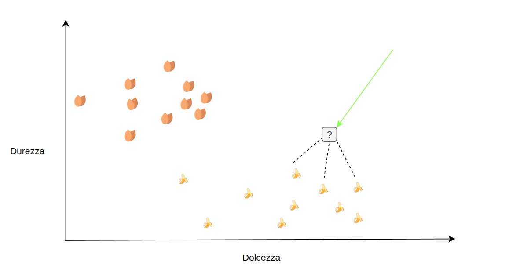

## Cos’è il Machine Learning?
> **Programma classico**: esecuzione diretta di una serie di istruzioni, come un ragazzo che segue una ricetta di cucina.

> **Programma ML**: costruisce un modello in base a dati e statistiche, riesce a risolvere, con un certo grado di errore, problemi mai visti, adattandosi. Un pò come la nonna che ha seguito ricette per anni e ora è capace di cucinare senza.

**Dove viene usata?**  
Ormai quasi ovunque: raccomandazioni video, filtri anti‑spam, traduzioni automatiche, ...

---

## L’AI non è sempre “complicata”
**Esempio quotidiano:** il filtro anti‑spam della tua email : il modello analizza parole chiave, mittente, struttura del messaggio e decide se è spam o no.

**Pensiero chiave:** l’AI non è magia: è basata su regole statistiche che possiamo spiegare.

> Ma può diventarlo facilmente, ad esempio con le Reti neurali convoluzionali

---

## Algoritmi di base: il K‑Nearest Neighbours (KNN)
> Un'azienda di imballaggi deve smistare i suoi prodotti per far in modo che vengano inseriti nei corretti veicoli per il trasporto. 

*Per noi umani sembra banale ma per un sistema automatico puo' essere un problema piu' complicato di quello che pensate.*

> Serve un dispositivo che, tramite dei **sensori**, riesce ad identificare le scatole di legno rispetto a quelle di cartone: **categorizzazione**.

> Come gli umani, questo algoritmo a bisogno di dati di base per essere poi in grado di categorizzare le nuove scatole con una certa precisione (Immaginate di farlo voi senza sapere cosa sia una scatola e senza poter guardare).

## Algoritmo con esempio

### Fase di apprendimento
- Prendo 10 banane e 10 mandorle, le mangio, misuro la dolcezza.
- Ora devo misurare la durezza, forse dovevo farlo prima.
- Compro altre 10 banane e 10 mandorle, misuro durezza e dolcezza.
- Metto i dati in un grafico.

### Calcolo della distanza
- Quando si riceve un nuovo frutto, lo si vuole classificare come banana o mandorle.
- Si misura il nuovo frutto.
- Si calcola la distanza tra il nuovo frutto e quelli gia' inseriti.
- Si vedono i K frutti piu' vicini.

### Fase di classificazione
- Se il nuovo frutto e' piu' vicino alle banane, allora si ipotizza che sia una banana dato che le sue caratteristiche misurati sono piu' come quelle delle banane.

---

## Dove troviamo KNN nella vita reale?
> Se abbiamo 12 sensori invece che due, nulla ci vieta di usare tutte e 12 le misure. Non potremo visualizzarle in un grafico tutte insieme ma il calcolo della distanza resta fattibile e l'algoritmo funziona.

| Settore            | Applicazione concreta                                                                 |
|--------------------|--------------------------------------------------------------------------------------|
| **Riconoscimento immagini** | Classificazione di foto di piante o animali in base a esempi già etichettati. |
| **Diagnostica medica**      | Predire la tipologia di tumore confrontando le caratteristiche di un nuovo paziente con casi noti. |
| **Sistemi di raccomandazione** | Suggerire prodotti simili a quelli già acquistati da utenti con gusti analoghi. |

*Grazie per l’attenzione!*
